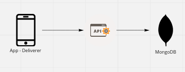

# Data Practice: Deliverer Data

Practicing the Data mindset and coding, based on Open-Source and AWS Tools.

### Contents

- airflow (not yet used)
- app_api
- images (for README)
- mongodb
- mqtt
- publisher
- spark_compose (not yet used)
- subscriber
- start.sh (for starting containers)
- stop.sh (for stopping containers

## Problem & Goal

Simple and light real-time Delivery App API for storage(app system) and consuming(app customer) data, with a posterior data pipeline.

Goal: Achieve a good architecture for the production environment and code for the development environment.

### "Business" Problems:

- Some way to send the data;
- Where the location data is stored initially;
- Where and how we can store the data after the first gathering;
- Where and how we can turn this data to be "distributed" to other areas in the business;
- Where and how we "distribute" the data to the customer app in a fast and reliable way;
- How to not lose any of the fast data coming and going;

## Pipeline Architecture Planning

### First Step: What?

First, we need something to generate the data(publisher). Then we need to send it to an API(flask).
The API is there to encapsulate the application and in this case, where the data will go. Here we will send the data to MongoDB, a reliable No SQL database that can scale later.



- Data generated by an app, simulated by the `publisher`;
- MongoDB, No-SQL Database, simulating the DB at the company system;
- An API, the connection between the app and the company system;

So from here (Figure 1) we can begin to code. But while coding we can see some flaws in this:

- We can't consume (user of the app) the data from the API (last location data for example).
- We can't guarantee that a single API can manage to sustain a large number of POST requests simultaneously.

### Second Step: Consuming

To change how to consume, we can add a `GET` route to the API that makes a query to MongoDB to get the last location data from an order_id.
To change how to make it a little more scalable, we can add a pub/sub mechanism like Kafka. Here we use [Eclipse Mosquitto](https://mosquitto.org) used in IoT architectures because is easier to set up and can also scale if needed.


Now we have an architecture similar to the Figure 2 below:


The same resources:
- Data generated by an app, simulated by the `publisher`;
- MongoDB (`mongodb`), No-SQL Database, simulating the DB at the company system;
- Producer endpoint at the API (`app_api`), the connection between the app and the company system;

And new resources:
- A `mqtt` broker, to help dealing with the messages;
- Consuming endpoint at the API (`app_api`), simulating a user watching the progress in the app;
- A `subscriber` that consumes from the mqtt topic and populates mongo;

Now we have a potentially scaling architecture (not really but...) we can begin to be worried about the data pipeline.
- How we will consume data from the MongoDB history of location data?
- We can consume it in near/real-time?
- After consuming it, where do we put the data?
- After storing the data, will we transform it?
- If we want to join with other sources of data, what do we do?


### Third Step: Data Platform

Well, one of the many possible solutions could be something like Figure 3:


The same resources:
- Data generated by an app, simulated by the `publisher`;
- MongoDB (`mongodb`), No-SQL Database, simulating the DB at the company system;
- Producer endpoint at the API (`app_api`), the connection between the app and the company system;
- A `mqtt` broker, to help dealing with the messages;
- Consuming endpoint at the API (`app_api`), simulating a user watching the progress in the app;
- A `subscriber` that consumes from the mqtt topic and populates mongo;

And new resources:
- Using S3 as a data lake
- Using Spark to transform data in the data lake
- Athena or any other DB to deliver the treated data (to models or BI Tools)


### Fourth Step: Orchestration and Real-Time Data?


The same resources:
- Data generated by an app, simulated by the `publisher`;
- MongoDB (`mongodb`), No-SQL Database, simulating the DB at the company system;
- Producer endpoint at the API (`app_api`), the connection between the app and the company system;
- A `mqtt` broker, to help dealing with the messages;
- Consuming endpoint at the API (`app_api`), simulating a user watching the progress in the app;
- A `subscriber` that consumes from the mqtt topic and populates mongo;
- Using S3 as a data lake;
- Using Spark to transform data in the data lake;
- Athena or any other DB to deliver the treated data (to models or BI Tools);

And new resources:
- Airflow to orchestrate all the pipeline;
- Load Balancers to control traffic to replica instances of the company system;
- Spark Streaming to treat real-time data...(if needed);
- Lambda Functions to automate partitions in data lake;

<!-- Describe Figure 3
We can see that the pipeline in figure 2 becomes a little more complicated. Let’s
revisit all the steps and tools:
• App(publisher) sends the data in form of a JSON to the API
• Load Balancer divides this traffic so each broker will not be overwhelmed
• A pub/sub-broker cluster, represented by the MQTT logo, is a cluster to not depend on
one machine(Autoscaling included in ALB, Cluster, and MongoDB)
• MongoDB to store the "fast data". MongoDB, why? Very "queryable" and scalable
with Shards and replicas! (Mongo Atlas is a choice to make easier!)
-->

Airflow can orchestrate an ingestion every X period to the data lake, so we
never lose data! (Data - Lake)
• Spark(EMR) transforms the data, to a treated and more "queryable" way. Here we
can have AWS Glue or a Lambda function in the ingestion to make the partitions
available to Spark to find
• Spark puts the data on the data lake again(we can transform and join with other
                                             datasets), making a new layer of treated data. (number of layers depends on the
                                                                                             data and use cases)
• With the final data in S3 we can map all the partitions and meta-data with AWS
Glue ( or lambda functions orchestrated by Airflow);
• To distribute the treated and final data, we can load the data to an RDBMS or
columnar database and connect it to some BI tool. But, we can query directly on
the S3 with Athena, which can turn out to be cheaper as compared to maintaining a
database
• When in a database or Athena, we can query all we want! Using Metabase, or
QuickSight or any other tool that democratizes the access to data(with controlled
                                                                  permissioning)!


### Fifth Step: Connecting and Scaling!


The same resources:
- Data generated by an app, simulated by the `publisher`;
- MongoDB (`mongodb`), No-SQL Database, simulating the DB at the company system;
- Producer endpoint at the API (`app_api`), the connection between the app and the company system;
- A `mqtt` broker, to help dealing with the messages;
- Consuming endpoint at the API (`app_api`), simulating a user watching the progress in the app;
- A `subscriber` that consumes from the mqtt topic and populates mongo;
- Using S3 as a data lake;
- Using Spark to transform data in the data lake;
- Athena or any other DB to deliver the treated data (to models or BI Tools);
- Airflow to orchestrate all the pipeline;
- Load Balancers to control traffic to replica instances of the company system;
- Spark Streaming to treat real-time data...(if needed);
- Lambda Functions to automate partitions in data lake;

And new resources:
- Connecting/Ingesting other data sources to expand use;
- Using a Columnar Database for better analytics perfomance;
- Suggestion of Kubernetes Cluster to scale everything in a better way;

<!-- FINAL COMMENTS? -->


This code was made to "test" bursts, so it’s an only time run, to see what’s happening
and use PostMan to see the last location of a deliverer in a determined order. All the
user interface should be done by the apps and the apps can request the API for
getting or sending what’s needed.

In the file "mongo_ingestion.py" we can see how can ingest and secure the MongoDB
data, and if we feel safe, delete from there from time to time, to ensure performance in
the application ( or use airflow!).

For processing we have:
• "hive_deliverer_location.hql": To spark to read it more easily
• "deliverer_location_process.py": Transformation(treatment) for another layer of
data - lake
• "emr_cluster.sh"airflow can call it using BashOperator ( or use EMR Operators) to
create a cluster and run the above files
Since the tasks before TERRAFORM are about talking about stuff, here we go!

The file "location_pub" does the app part, and generates location data in a multi-
threaded way to reflect the original burst in real life, it has parameters like "delta time
between locations", "number of locations per order" and "simultaneous workers" which also
denotes the number of simultaneous orders. It generates a simple JSON with "order id, deliverer id, delivery state, timestamp,
latitude, longitude" and sends to the API mentioned earlier.


The file "location_sub.py" subscribes to the MQTT broker and decides what to do with the message. In the file, it decodes the message and sends it straight away to MongoDB.

• Start composing
• Open PostMan and get ready to choose an order_id to make the GET request.
• Change the parameters in The Location Publisher in python.
• Start The Location Publisher.
• Choose an order_id.
• Make some Get requests on the API with PostMan with the order_id to follow the
evolution of "Last Deliverer Location".

Watch the show!


## Finally: The "Why's"

Why all this? Why all that? We need our data flowing fast and consistently. Any loss of data can destroy someone’s experience with the product ( and we’re only talking about the deliverer’s location, imagine all the others!) We need our data flowing fast! But only when needed. Any unnecessary increase in real-time and near-real-time tools and processes can be very expensive, in people’s time and money itself. So, because of that, we need a good architecture, scalable and reliable, that’s why! 

A good architecture provides not only functional and beautiful applications but also ensures good, reliable data to have some insights. That’s why the second part of the architecture, with Airflow orchestrating all the flow of data, tests on software and data, microservices management... We ingest to our data lake, transform, treat, join with other applications data(internal systems, external data, apps), and make some good datasets to SQL them! But to make all the transformations with Spark(on EMR for example), we need the partitions loaded in a meta-store, like Hive! Glue can scrape all the s3 data and give us this! But if we need an event architecture almost instant partitions created in the meta-store, the best way is to use a lambda function that loads each partition dynamically right on the ingestion to S3. This depends on the use - case.

All data in the data - lake should be stored in a standardized way, with decent partitioning to make all the applications that query them in an easier and faster way. With that done, all the layers(Bronze / Silver / Gold or Raw / Treated / Final....) are organized, applications and users can use them as they want, and doing this correctly we can democratize the data access because, with organization, we know who can access what.

The democratization process needs a good tool that enables it, Trino(or Presto on Athena) + Metabase is my favorite tool today for doing "LakeHouse Metrics", where people can query directly on the Data Lake(S3). Some applications need more performance on analytical queries, so we can use the OLAP way of modeling our data and put them in S3 or an Analytical Database. Using OLAP modeling enables us to use columnar databases like Redshift, ClickHouse, and others, and make queries like the one below with billions of rows in no time.
```sql
SELECT
state,
SUM(number) AS my_number
WHERE date > 1900
GROUP BY state
```
Connecting a good business intelligence tool to any of these architectures provides a healthy insights department where all companies can benefit.

Designing a good DW(Holy Kimball!) with good facts and dimensions, or aggregate facts and dimensions for each area(one table with all the areas needed). Snowflake, Inomn, and DataVault can be good paths, it depends on the data culture in the company and access to good BI tools. Well, after writing this little text I can safely say now that, this part, designing architectures and understanding them is what I like to do!

## To-Do:

- Finish this text
   - Explain more each step
- Docstrings
- Implement Metabase to read MongoDB
   - Plan some insights or nice vizualizations
   - Dashboards
- Implement Airflow
   - Implement ingestion MongoDB to S3
- Implement a "dev" Spark Cluster
   - With docker-compose
   - Treat raw data from MongoDB to S3
   - Data Lake Semantic Layers
- Implement DW
   - Analytics Database with docker-compose
   - Ingest Data S3 to DW
   - Connect DW to Metabase
- Look for possible refactor
- Tests(yea, not TDD here)
- Test Kafka
